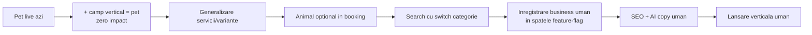

# CalyHub — Blueprint Multi-Verticală (Pet + Uman)

> Document de strategie & arhitectură. Scop: extinderea CalyHub de la platformă de grooming
> animale la **hub de programări pentru toată familia** — saloane pentru animale **și** pentru
> oameni (frizerii, coafor, unghii, cosmetică etc.), pe **aceeași bază de cod**, fără a strica
> ce există.
>
> Status: schiță pentru discuție. Nimic din codul aplicației nu a fost modificat.

---

## 1. Viziunea într-o frază

**CalyHub — programări pentru toată familia. Cu blană sau fără.**

Un singur cont în care o gospodărie își programează *tot*: tatăl la frizer, mama la coafor,
copilul la tuns, câinele la grooming. Nimeni de pe piață nu deține această intersecție:
- Booksy / Fresha / Treatwell → oameni, dar **nu** animale.
- Aplicațiile de pet → animale, dar **nu** oameni.
- **CalyHub → ambele, sub un singur brand.**

## 2. Argumentul de piață (de ce merită)

| | Pet grooming | Îngrijire umană |
|---|---|---|
| Penetrare | ~30% din stăpâni | ~100% (toți se tund/coafează) |
| Frecvență | 3-4× / an | Bărbați ~la 4 săptămâni, femei frecvent |
| Volum potențial | Nișă | De zeci de ori mai mare |
| Concurență | Aproape inexistentă | Mare (Booksy, Fresha) |
| Rol în strategie | **Cârlig unic (moat)** | **Volum & frecvență (motor)** |

Pet-ul rămâne diferențiatorul pe care concurenții nu-l pot copia ușor. Uman-ul aduce masa
critică. Împreună = poziție defensabilă.

## 3. Principiul arhitectural cheie

> **Verticala este o dimensiune a datelor, NU un fork de aplicație.**

O singură bază de cod. Un business are o *verticală* (`pet` | `uman`, extensibil). Tot ce e
specific pet-ului (profil animal, preț per talie) devine **configurația unei verticale**, nu cod
care se șterge. Motorul comun (agendă, echipă, booking, recenzii, statistici, notificări, AI)
rămâne identic.

**Regula de aur a migrării:** tot ce există azi devine automat `vertical = 'pet'` și
funcționează **exact ca înainte**. Refactorizarea e *aditivă*, nu distructivă.

---

## 4. Ce e deja reutilizabil 1:1 (nu se atinge logica)

Aceste module sunt agnostice de verticală — merg pe frizerie exact ca pe grooming:

- Agendă / calendar per specialist, sloturi 30 min, blocări, „în așteptare primele"
- Echipă / specialiști cu orar individual
- Confirmare / refuz programare
- Notificări in-app (client + business)
- Recenzii + rating agregat
- Statistici (încasări, top servicii, productivitate, evoluție lunară, export Excel)
- Dashboard business + dashboard client
- Cele 4 funcții AI (doar *wording*, vezi §9)
- Cross-device sync (Supabase source of truth)
- Abonamente Basic / Pro / Business (aceeași structură)

**≈ 80% din produs trece neatins.**

---

## 5. Ce se schimbă (modelul de date)

### 5.1 Business (`saloane`)
Păstrăm numele tabelului `saloane` (evită churn în tot codul), dar conceptual devine „business".

```sql
alter table public.saloane
  add column vertical text not null default 'pet';   -- 'pet' | 'uman'
-- (opțional, mai granular pentru SEO/filtre)
alter table public.saloane
  add column subcategorii text[] default '{}';       -- ex: ['frizerie','barbershop'] sau ['grooming']
```
> Toate rândurile existente → `vertical='pet'`. Zero impact pe datele curente.

Un business poate fi, în viitor, **mixt** (ex: salon care face și tuns om, și grooming) →
`vertical` principal + `subcategorii`. Decizie deschisă (§13).

### 5.2 Servicii & prețuri — generalizarea „taliei"
Azi prețul depinde de **talia animalului**. Generalizăm la **variante de preț** cu etichete
definite de verticală:

```jsonc
// serviciu (concept, structura JSON exactă de confirmat în cod)
{
  "nume": "Tuns",
  "durata": 30,
  "variante": [                 // înlocuiește "preț per talie"
    { "eticheta": "Scurt",  "pret": 40 },
    { "eticheta": "Mediu",  "pret": 50 },
    { "eticheta": "Lung",   "pret": 70 }
  ]
}
```
- **Pet:** etichetele variantelor = talii (Mică / Medie / Mare / XL) — ca acum.
- **Uman (frizerie):** de regulă **fără variante** (un preț) sau variante gen păr scurt/lung.
- **Uman (coafor):** variante pe lungime păr / tip serviciu.

Verticala definește *setul de etichete sugerate*; business-ul le poate personaliza.

### 5.3 Subiectul programării — animal opțional
Azi booking-ul cere „alege animalul". Îl facem **opțional**, condiționat de verticală:

```sql
alter table public.programari
  add column subiect_tip text default 'animal';   -- 'animal' | 'persoana'
-- animal_id devine nullable (dacă nu e deja)
```
- **Business pet** → clientul alege animalul (flow actual, neschimbat).
- **Business uman** → programare pentru client direct, fără pas de animal.

### 5.4 Entități de profil
- `animale` (profil animal) rămâne — folosit doar de verticala pet.
- Profilul clientului (uman) există deja (nume, telefon, avatar). La verticala umană,
  „subiectul" e clientul însuși.
- **Faza „hub" (mai târziu):** conceptul de **gospodărie** — un cont care grupează
  membri (oameni) + animale, ca să programezi pentru oricine dintr-un loc. Vezi §11, Faza 4.

---

## 6. Migrarea fără să strici nimic (strategia de siguranță)

1. **Branch dedicat**; pet-ul rămâne 100% funcțional pe tot parcursul.
2. `vertical` cu `default 'pet'` → backfill automat, datele existente intacte.
3. **Feature flag** `ENABLE_HUMAN_VERTICAL` — verticala umană stă ascunsă până e gata.
4. Generalizare **incrementală**, în pași independenți, fiecare testabil:
   servicii/variante → animal opțional → search cu categorii → înregistrare uman → SEO → AI copy.
5. Nimic nu se aruncă — se **re-etichetează** ca „verticala pet".



---

## 7. UX & fluxuri

### 7.1 Client (descoperire + booking)
- **Switch de categorie sus:** `Oameni` / `Animale` → apoi serviciu, oraș, rating.
- Booking uman: alege salon → serviciu (+ variantă) → specialist → slot → observații → trimite.
- Booking pet: identic + pas „alege animalul".

### 7.2 Business (înregistrare)
- Wizard-ul de înregistrare **ramifică pe verticală** la pasul 1:
  - Pet → pași actuali (servicii grooming, talii, galerie).
  - Uman → servicii de frizerie/coafor, variante fără talie, galerie.
- Restul wizard-ului (date firmă, echipă, orar) — **comun**.

## 8. SEO multi-verticală
- Pagini noi pe orașe + categorie: `frizerii-bucuresti`, `coafor-cluj`, `barbershop-timisoara`,
  în paralel cu cele de grooming existente.
- Sitemap + rewrites extinse. Atenție: concurență Google mare pe termenii umani → strategie de
  conținut mai agresivă (recenzii, pagini de salon bogate, long-tail pe cartiere).

## 9. AI per verticală — și un avantaj nou

Cele 4 funcții existente merg pe uman cu **schimbare de wording**:
- Răspunsuri la recenzii → identic.
- Clienți inactivi → **mai puternic pe uman** (cadență regulată = abatere ușor de detectat).
- „Fișă post-grooming" → „recomandare de îngrijire păr/barbă" / sfaturi post-serviciu.
- Consultant AI → identic.

**Funcție nouă, unlock-uită de frecvența umană:**
- **Predicție de rebooking.** Un bărbat se tunde la ~4 săptămâni. AI-ul învață cadența fiecărui
  client și trimite nudge exact la momentul potrivit → programări recurente aproape automate.
  Pet-ul n-a avut niciodată frecvența asta; uman-ul o are → AI mai valoros, retenție mai mare.

## 10. Branding & logo

- Numele **CalyHub** se extinde natural — „Hub" implică deja multi-serviciu. **Rămâne.**
- **Logo-ul (câine+pisică) trebuie regândit** — nu mai acoperă frizeria. Direcție: identitate
  umbrelă, abstractă, care „găzduiește" ambele lumi; brandul portocaliu + Nunito rămân.
- Tagline: *„Programări pentru toată familia. Cu blană sau fără."*
- Materialele deja făcute (cele două prezentări) devin baza pentru un set: pet, uman, umbrelă.

## 11. Plan pe faze

| Faza | Obiectiv | Livrabile principale |
|---|---|---|
| **1. Fundația** | Arhitectură multi-verticală, pet neatins | Câmp `vertical`; servicii→variante; animal opțional în booking; flag |
| **2. MVP Uman** | Prima verticală umană funcțională | Wizard înregistrare frizerie/coafor; booking fără animal; search cu categorii; 1-2 orașe pilot |
| **3. Brand & Hub public** | Identitate umbrelă + descoperire | Logo nou; homepage cu ambele lumi; SEO uman; copy |
| **4. AI & Gospodărie** | Diferențiatorul de comunitate | Profil gospodărie (oameni+animale); predicție rebooking; cross-vertical discovery |
| **5. Plăți & scalare** | (deja pe roadmap-ul de lansare) | Stripe/abonamente reale, facturare — comun pe verticale |

> Estimare la nivel înalt: **săptămâni de muncă focusată**, nu rewrite. Greul nu e codul —
> e **achiziția de business-uri umane** (piață concurată) și **redesign-ul de brand**.

## 12. Riscuri & mitigări

| Risc | Mitigare |
|---|---|
| Concurență mare pe uman (Booksy/Fresha) | Poziționare household pet+uman (unghi unic); abonamente ieftine; AI de rebooking |
| Diluarea focusului | Faze clare; pet rămâne funcțional tot timpul; flag pe uman |
| Achiziția business-urilor umane | Pilot pe 1-2 orașe; ambasadori; onboarding gratuit primele luni |
| Refactor rupe pet-ul | Migrare aditivă, branch, `default 'pet'`, teste per pas |
| Brand pet-centric respinge frizerii | Logo/brand umbrelă înainte de lansarea publică uman |

## 13. Decizii deschise (am nevoie de tine)

1. **Lansare:** pornim direct cu ambele verticale public, sau pet e deja live și uman vine ca val 2?
2. **Verticale umane la start:** doar frizerie + coafor? sau și unghii / cosmetică / masaj?
3. **Business mixt:** un salon poate avea și pet, și uman sub același cont? (afectează modelul)
4. **Household profile:** îl vrem devreme (diferențiator) sau după MVP-ul umane?
5. **Logo:** păstrăm silueta animalelor undeva sau mergem complet abstract/umbrelă?
6. **Nume verticale în UI:** „Oameni / Animale", „Îngrijire / Grooming", altceva?

## 14. Ce NU se schimbă (ca să dormi liniștit)

Agenda, echipa, confirmările, notificările, recenziile, statisticile, exportul Excel, dashboard-urile,
cross-device sync, structura de abonamente și motorul AI — **rămân**. Le pui o caroserie nouă și un
al doilea rând de scaune. Motorul e același.

---

*Următorul pas propus: alegem răspunsurile la §13, apoi detaliez Faza 1 la nivel de task-uri
concrete (migrări SQL exacte, ecrane de atins, ordine de implementare).*
